# 스프링 핵심 원리 - 기본편 정리 v2021-01-08
스프링 기초

## 전체 목차
[1.객체 지향 설계와 스프링](#객체-지향-설계와-스프링)

[2.예제 만들기](#예제-만들기)

[3.객체 지향 원리 적용](#객체-지향-원리-적용)

[4.스프링 컨테이너와 스프링 빈](#스프링-컨테이너와-스프링-빈)

[5.싱글톤 컨테이너](#싱글톤-컨테이너)

[6.컴포넌트 스캔](#컴포넌트-스캔)

[7.의존관계 자동 주입](#의존관계-자동-주입)

[8.빈 생명주기 콜백](#빈-생명주기-콜백)

[9.빈 스코프](#빈-스코프)

## 객체 지향 설계와 스프링

### 스프링 프레임워크
- **핵심 기술** : 스프링 DI 컨테이너, AOP, 이벤트, 기타
- **웹 기술** : 스프링 MVC, 스프링 WebFlux
- **데이터 접급기술** : 트랜잭션, JDBC, ORM 지원, XML 지원
- **기술 통합** : 캐시, 이메일, 원격접근, 스케줄링
- **테스트**: 스프링 기반 테스트 지원
- **언어** : 코틀린, 그루비
- 최근에는 스프링 부트를 통해서 스프링 프레임워크의 기술들을 편리하게 사용


### 스프링 부트
- **스프링을 편리하게 사용할 수 있도록 지원, 최근에는 기본으로 사용**
- 단독으로 실행할 수 있는 스프링 애플리케이션을 쉽게 생성
- Tomcat같은 웹 서버를 내장해서 별도의 웹 서버를 설치하지 않아도 됨
- 손쉬운 빌드 구성을 위한 starter 종속성 제공
- 스프링과 3rd parth(외부) 라이브러리 자동 구성
- 메트릭, 상태확인, 외부 구성 같은 프로덕션 준비 기능 제공

### 스프링 핵심
- 스프링은 자바 언어 기반의 프레임워크 
- 자바 언어의 가장 큰 특징 - **객체 지향 언어**
- 스프링은 객체 지향 언어가 가진 강력한 특징을 살려내는 프레임워크
- 스프링은 **좋은 객체 지향** 애플리케이션을 개발할 수 있게 도와주는 프레임워크 

### 다형성 실세계
 
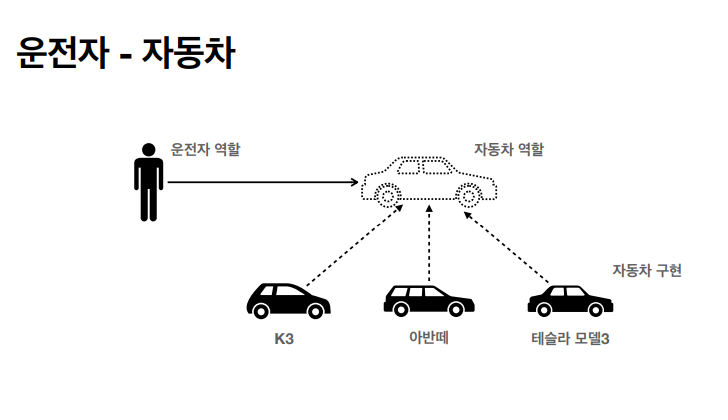

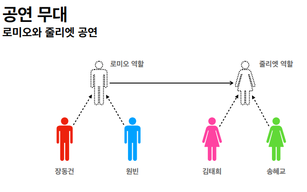

### 역할과 구현을 분리
- **역할**과 **구현**으로 구분하면 세상이 단순해지고, **유연**해지며 **변경**도 편리해진다.
- **장점**
    + 클라이언트는 대상의 역할(인터페이스)만 알면 된다.
    + 클라이언트는 구현 대상의 내부 구조를 몰라도 된다.
    + 클라이언트는 구현 대상의 내부 구조가 변경되어도 영향을 받지 않는다.
    + 클라이언트는 구현 대상 자체를 변경해도 영향을 받지 않는다. 

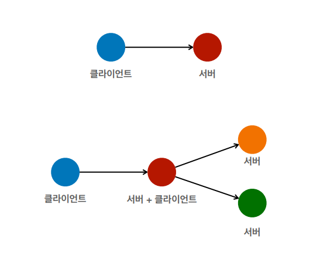    

### 다형성의 본질
- **클라이언트 변경하지 않고,서버의 구현 기능을 유연하게 변경할 수 있다.**


### SOLID
클린코드로 유명한 로버트 마틴이 좋은 객체 지향 설계의 5가지 원칙을 정리

- SRP: 단일 책임 원칙 (single responsibility principle)
  + 한 클래스는 하나의 책임만 가져야 한다.
  + **즁요한 기준은 변경**이다. 변경이 있을 때 파급 효과가 적으면 단일 책임 원칙을 잘 따른 것 
- OCP : 개방-폐쇄 원칙(Open/closed principle)
    + 소프트웨어 요소는 **확장에는 열려** 있느나 변경에는 닫혀 있어야 한다
    + 다형성을 활용해보자.
    + 구현 객체를 변경하려면 클라이언트 코드를 변경해야 한다.
    + 분명 다형성을 사용했지만 OCP 원칙을 지킬 수 없다.
- LSP : 리스코프 치환 원칙 (Liskov substitution principle)
    + 프로그램의 객체는 프로그램의 정확성을 깨뜨리지 않으면서 하위 타입의 인스턴스로 바꿀 수 있어야 한다.
- ISP: 인터페이스 분리 원칙 (Interface segregation principle)
    + 특정 클라이언트를 위한 인터페이스 여러 개가 범용 인터페이스 하나보다 낫다.
- DIP : 의존관계 역전 원칙 (Dependency inversion principle)
    + 프로그래머는 "추상화에 의존해야지, 구체화에 의존하면 안된다" 의존성 주입은 이 원칙을 따르는 방법 중 하나이다.
    
## 예제 만들기

### 목차
[2.스프링 핵심 원리 이해1 -예제만들기 - 비즈니스 요구사항과 설계](#비즈니스-요구사항과-설계)

[2.스프링 핵심 원리 이해1 -예제만들기 - 회원 도메인 설계](#회원-도메인-설계)

[2.스프링 핵심 원리 이해1 -예제만들기 - 회원 도메인 개발](#회원-도메인-개발)

[2.스프링 핵심 원리 이해1 -예제만들기 - 회원 도메인 실행과 테스트](#회원-도메인-실행과-테스트)

[2.스프링 핵심 원리 이해1 -예제만들기 - 주문과 할인 도메인 설계](#주문과-할인-도메인-설계)

[2.스프링 핵심 원리 이해1 -예제만들기 - 주문과 할인 도메인 개발](#주문과-할인-도메인-개발)

[2.스프링 핵심 원리 이해1 -예제만들기 - 주문과 할인 도메인 실행과 테스트](#주문과-할인-도메인-실행과-테스트)

### 비즈니스 요구사항과 설계
- 회원
    + 회원을 가입하고 조회할 수 있다.
    + 회원은 일반과 VIP 두 가지 등급이 있다.
    + 회원 데이터는 자체 DB를 구축할 수 있고, 외부 시스템과 연동할 수 있다. (미확정)
- 주문과 할인 정책
    + 회원은 상품을 주문할 수 있다.
    + 회원 등급에 따라 할인 정책을 적용할 수 있다.
    + 할인 정책은 모든 VIP는 1000원을 할인해주는 고정 금액 할인을 적용해달라. (나중에 변경 될 수 있 다.)
    + 할인 정책은 변경 가능성이 높다. 회사의 기본 할인 정책을 아직 정하지 못했고, 오픈 직전까지 고민을 
      미루고 싶다. 최악의 경우 할인을 적용하지 않을 수 도 있다. (미확정)


### 회원 도메인 설계
- 회원 도메인 요구사항
    + 회원을 가입하고 조회할 수 있다,.
    + 회원은 일반과 VIP 두 가지 등급이 있다.
    + 회원 데이터는 자체 DB를 구축할 수 있고, 외부 시스템과 연동할 수 있다.(미확정)
  
**회원 도메인 협력 관계**

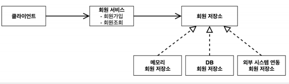

**회원 클래스 다이어그램**

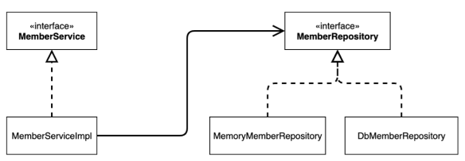


### 회원 도메인 개발

**회원 엔티티**

**회원 등급**

```java
public enum Grade {
    BASIC,
    VIP
}
```

**회원 엔티티**
```java
public class Member {
    private Long id;
    private String name;
    private Grade grade;

    public Member(Long id, String name, Grade grade) {
        this.id = id;
        this.name = name;
        this.grade = grade;
    }

    public Long getId() {
        return id;
    }

    public void setId(Long id) {
        this.id = id;
    }

    public String getName() {
        return name;
    }

    public void setName(String name) {
        this.name = name;
    }

    public Grade getGrade() {
        return grade;
    }

    public void setGrade(Grade grade) {
        this.grade = grade;
    }

    @Override
    public String toString() {
        return "Member{" +
                "id=" + id +
                ", name='" + name + '\'' +
                ", grade=" + grade +
                '}';
    }
}
```

**회원 저장소**

**회원 저장소 인터페이스**
```java
public interface MemberRepository {
    void save(Member member);
    Member findById(Long memberId);
}
```

**회원 저장소 구현체**
```java
public class MemoryMemberRepository implements MemberRepository{

    private static Map<Long, Member> store = new HashMap<>();

    @Override
    public void save(Member member) {
        store.put(member.getId(), member);
    }

    @Override
    public Member findById(Long memberId) {
        return store.get(memberId);
    }

}
```
**회원 서비스** 

**회원 서비스 인터페이스**
```java
public interface MemberService {
    void join(Member member);

    Member findMember(Long memberId);
}
```

**회원 서비스 구현체**
```java
public class MemberServiceImpl implements MemberService{

    private final MemberRepository memberRepository = new MemoryMemberRepository();

    @Override
    public void join(Member member) {
        memberRepository.save(member);
    }

    @Override
    public Member findMember(Long memberId) {
        return memberRepository.findById(memberId);
    }

}
```
### 회원 도메인 실행과 테스트
**회원 도메인 테스트**

```java
public class MemberServiceTest {

    private final MemberService memberService = new MemberServiceImpl();

    @Test
    void join(){
        // given
        Member member = new Member(1L, "memberA", Grade.VIP);

        //when
        memberService.join(member);
        Member findMember = memberService.findMember(1L);
        //then
        Assertions.assertThat(member).isEqualTo(findMember);

    }
}
```

**회원 도메인 설계의 문제점**
- 이 코드의 설계상 문제점은 무엇일까?
- 다른 저장소로 변경할 때 OCP 원칙을 잘 준수할까요? 
- DIP를 잘 지키고 있을까?
- **의존관계가 인터페이스 뿐만 아니라 구현까지 모두 의존하는 문제점이 있음**

### 주문과 할인 도메인 설계
- 주문과 할인 정책
  + 회원은 상품을 주문할 수 있다. 
  + 회원 등급에 따라 할인 정책을 적용할 수 있다. 
  + 할인 정책은 모든 VIP는 1000원을 할인해주는 고정 금액 할인을 적용해달라. (나중에 변경 될 수 있다.)
  + 할인 정책은 변경 가능성이 높다. 회사의 기본 할인 정책을 아직 정하지 못했고, 오픈 직전까지 고민을 미루고 싶다.
  최악의 경우 할인을 적용하지 않을 수 도 있다. (미확정)
    
**주문 도메인 협력,역할,책임**
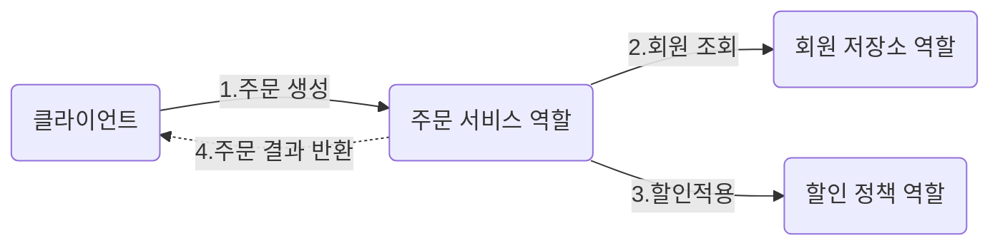
**1. 주문생성** : 클라이언트는 주문 서비스에 주문 생성을 요청한다.
**2. 회원조회** : 할인을 위해서는 회원 등급이 필요하다. 그래서 주문 서비스는 회원 저장소에서 회원을 조회한다.
**3. 할인적용** : 주문 서비스는 회원 등급에 따른 할인 여부를 할인 정책에 위임한다.
**4. 주문 결과 반환** : 주문 서비스는 할인 결과를 포함한 주문 결과를 반환한다.

**주문 도메인 전체**

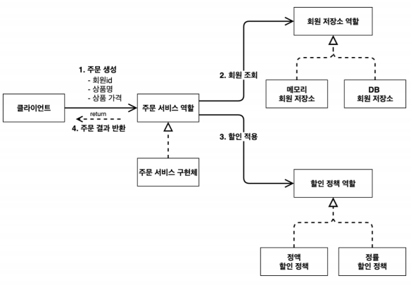

역할과 구현을 분리해서 자유롭게 구현 객체를 조립할 수 있게 설계 했다. 덕분에 회원 저장소는 물론이고, 할인 정책도 유연하게 변경할 수 있다.

**주문 도메인 클래스 다이어그램**
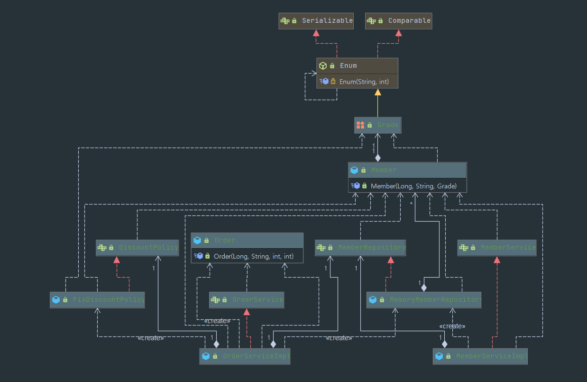

회원을 메모리에서 조회하고, 정액 할인 정책(고정 금액)을 지원해도 주문 서비스를 변경하지 않아도 된다.

회원을 메모리가 아닌 실제 DB에서 조회하고, 정률 할인 정책(주문 금액에 따라 %할인)을 지원해도 주문서비스를
변경하지 않아도 된다. 협력 관계를 그대로 재사용 할 수 있다. 

### 주문과 할인 도메인 개발
**할인 정책 인터페이스**
```java
public interface DiscountPolicy {

    /**
     * @return 할인 대상 금액
     */
    int discount(Member member, int price);
}
```

**정액 할인 정책 구현체**
```java
public class FixDiscountPolicy implements DiscountPolicy{
    private int discountFixAmount = 1000;

    @Override
    public int discount(Member member, int price) {
        if(member.getGrade() == Grade.VIP)
            return discountFixAmount;
        else
            return 0;
    }
}
```

**주문 엔티티**
```java
public class Order {
    private Long memberId;
    private String itemName;
    private int itemPrice;
    private int discountPrice;

    public Order(Long memberId, String itemName, int itemPrice, int discountPrice) {
        this.memberId = memberId;
        this.itemName = itemName;
        this.itemPrice = itemPrice;
        this.discountPrice = discountPrice;
    }

    public Long getMemberId() {
        return memberId;
    }

    public void setMemberId(Long memberId) {
        this.memberId = memberId;
    }

    public String getItemName() {
        return itemName;
    }

    public void setItemName(String itemName) {
        this.itemName = itemName;
    }

    public int getItemPrice() {
        return itemPrice;
    }

    public void setItemPrice(int itemPrice) {
        this.itemPrice = itemPrice;
    }

    public int getDiscountPrice() {
        return discountPrice;
    }

    public void setDiscountPrice(int discountPrice) {
        this.discountPrice = discountPrice;
    }

    @Override
    public String toString() {
        return "Order{" +
                "memberId=" + memberId +
                ", itemName='" + itemName + '\'' +
                ", itemPrice=" + itemPrice +
                ", discountPrice=" + discountPrice +
                '}';
    }
}
```
**주문 서비스 인터페이스**
```java
public interface OrderService {

    Order createOrder(Long memberId, String itemName, int itemPrice);

}
```
**주문 서비스 구현체**
```java
public class OrderServiceImpl implements OrderService{

    private final MemberRepository memberRepository = new MemoryMemberRepository();
    private final DiscountPolicy discountPolicy = new FixDiscountPolicy();

    @Override
    public Order createOrder(Long memberId, String itemName, int itemPrice) {
        Member member = memberRepository.findById(memberId);
        int discountPrice = discountPolicy.discount(member, itemPrice);
        return new Order(memberId, itemName, itemPrice, discountPrice);
    }
}

```
주문 생성 요청이 오면, 회원 정보를 조회하고, 할인 정책을 적용한 다음 주문 객체를 생성해서 반환한다.
**메모리 회원 리포지토리와, 고정 금액 할인 정책을 구현체로 생성한다.**

### 주문과 할인 도메인 실행과 테스트
**주문과 할인 정책 실행**
```java
public class OrderServiceTest {
    MemberService memberService = new MemberServiceImpl();
    OrderService orderService = new OrderServiceImpl();

    @Test
    void createOrder(){
        long memberId = 1L;
        Member member = new Member(memberId, "memberA", Grade.VIP);
        memberService.join(member);

        Order order = orderService.createOrder(memberId, "itemA", 10000);
        Assertions.assertThat(order.getDiscountPrice()).isEqualTo(1000);
    }
}

```

## 객체 지향 원리 적용

### 목차
[3.스프링 핵심 원리 이해2 - 객체 지향 원리 적용 - 새로운 할인 정책 개발](#새로운-할인-정책-개발)

[3.스프링 핵심 원리 이해2 - 객체 지향 원리 적용 - 새로운 할인 정책 적용과 문제점](#새로운-할인-정책-적용과-문제점)

[3.스프링 핵심 원리 이해2 - 객체 지향 원리 적용 - 관심사의 분리](#관심사의-분리)

[3.스프링 핵심 원리 이해2 - 객체 지향 원리 적용 - AppConfig 리펙터링](#AppConfig-리펙터링)

[3.스프링 핵심 원리 이해2 - 객체 지향 원리 적용 - 좋은 객체 지향 설계의 5가지 원칙의 적용](#좋은-객체-지향-설계의-5가지-원칙-적용)

[3.스프링 핵심 원리 이해2 - 객체 지향 원리 적용 - IoC,DI,그리고 컨테이너](#IoC,DI,그리고-컨테이너)

[3.스프링 핵심 원리 이해2 - 객체 지향 원리 적용 - 스프링으로 전환하기](#스프링으로-전환하기)

### 새로운 할인 정책 개발

**새로운 할인 정책을 확장해보자**
- **악덕 기획자** : 서비스 오픈 직전에 할인 정책을 지금처럼 고정 금액 할인이 아니라 좀 더 합리적인 주문 금액
당 할인하는 정률%할인으로 변경하고 싶어요. 예를 들어서 기존 정책은 VIP가 10000원을 주문하든 20000원을 주문하든 항상 1000원을 할인 했는데,
이번에 새로나온 정책은 10%로 지정해두면 고객이 10000원 주문시 1000원을 할인해주고, 20000원 주문시에 2000원을 할인해주는 거에요!

- **순진 개발자** : 제가 처음부터 고정 금액 할인은 아니라고 했잖아요.
- **악덕 기획자** : 애자일 소프트웨어 개발 선언 몰라요? "계획을 따르기보단 변화에 대응하기를"
- **순진 개발자** : ...(하지만) 난 유연한 설계가 가능하도록 객체지향 설계 원칙을 준수했지.

**RateDiscountPolicy 추가**
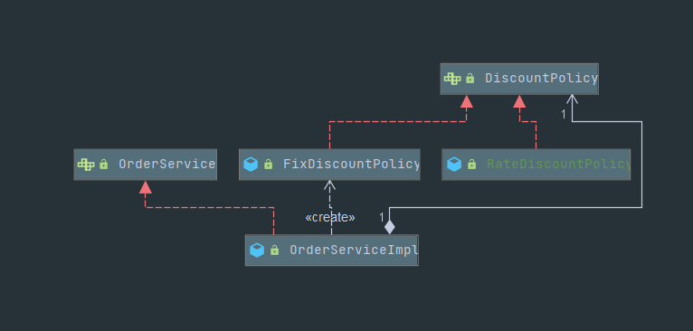

**RateDiscountPolicy 코드 추가**
```java
public class RateDiscountPolicy implements DiscountPolicy{

    private int discountPercent = 10;

    @Override
    public int discount(Member member, int price) {
        if (member.getGrade() == Grade.VIP) {
            return price * discountPercent / 100;
        }else{
            return 0;
        }
    }
}
```
**테스트 작성**
```java
class RateDiscountPolicyTest {

    RateDiscountPolicy discountPolicy = new RateDiscountPolicy();

    @Test
    @DisplayName("VIP 10% 할인이 적용되어야 한다.")
    void vip_o(){
        //given
        Member member = new Member(1L, "memberVIP", Grade.VIP);
        //when
        int discount = discountPolicy.discount(member, 10000);
        //then
        assertThat(discount).isEqualTo(1000);
    }

    @Test
    @DisplayName("VIP 아니면 할인이 적용되지 않아야 한다.")
    void vip_x(){
        //given
        Member member = new Member(2L, "memberBASIC", Grade.BASIC);
        //when
        int discount = discountPolicy.discount(member, 10000);
        //then
        assertThat(discount).isEqualTo(0);
    }
}
```

### 새로운 할인 정책 적용과 문제점
방금 추가한 할인 정책을 적용해보자.

할인 정책을 애플리케이션에 적용해보자

할인정책을 변경하려면 클라이언트인 ```OrderServiceImpl``` 코드를 고쳐야 한다.
```java
public class OrderServiceImpl implements OrderService {
// private final DiscountPolicy discountPolicy = new FixDiscountPolicy();
 private final DiscountPolicy discountPolicy = new RateDiscountPolicy();
}
```

**문제점 발견**
- 우리는 역할과 구현을 충실히 분리했다 -> OK
- 다형성도 활용하고, 인터페이스와 구현 객체를 분리했다. -> OK
- OCP, DIP 같은 객체지향 설계 원칙을 충실히 준수했다. 
  + 그렇게 보이지만 사실 아니다.
- DIP : 주문서비스 클라이언트 ```OrderServiceImpl```는  ```DiscountPolicy``` 인터페이스에 의존하면서 
DIP를 지킨 것 같은데?
  + → 클래스 의존관계를 분석해 보자. 추상(인터페이스) 뿐만 아니라 **구체(구현) 클래스에도 의존**하고 있다.
    + 추상(인터페이스) 의존 : ```DiscountPolicy``` 
    + 구체(구현)클래스 : ```FixDiscountPolicy```, ```RateDiscountPolicy```
- OCP : 변경하지 않고 확장할 수 있다고 했는데!!
  + **→ 지금 코드는 기능을 확장해서 변경하면, 클라이언트 코드에 영향을 준다!** 따라서 **OCP를 위반**한다.
  
**어떻게 문제를 해결할 수 있을까?**
- 클라이언트 코드인 ```OrderServiceImpl```은 ```DiscountPolicy```의 인터페이스 뿐만 아니라 구체 클래스도
함께 의존한다.
- 그래서 구체 클래스를 변경할 때 클라이언트 코드도 함께 변경해야 한다. 
- **DIP 위반 →** 추상에만 의존하도록 변경(인터페이스에만 의존)
- DIP를 위반하지 않도록 인터페이스에만 의존하도록 의존관계를 변경하면 된다. 

**인터페이스에만 의존하도록 설계를 변경하자**
```java
    private DiscountPolicy discountPolicy;
```
- 인터페이스에만 의존하도록 설계와 코드를 변경했다.
- **그런데 구현체가 없는데 어떻게 코드를 실행할 수 있을까?**
- 실제 실행을 해보면 NPE(Null Pointer exception)가 발생한다.

**해결방안**
- 이 문제를 해결하려면 누군가가 클라이언트인 ```OrderServiceImpl```에 ```DiscountPolicy```의 구현객체를 
대신 생성하고 주입해주어야 한다.
  
### 관심사의 분리
- 애플리케이션을 하나의 공연이라고 생각해보자. 각각의 인터페이스 배역(배우 역할)이라 생각하자. 그런데!
실제 배역에 맞는 배우를 선택하는 것은 누가 하는가?
- 로미오와 줄리엣 공연을 하면 로미오 역할을 누가 할지 줄리엣 역할을 누가 할지는 배우들이 정하는게 아니다.
이전 코드는 마치 로미오 역할(인터페이스)을 하는 레오나르도 디카프리오(구현체,배우)가 줄리엣 역할
  (인터페이스)을 하는 여자 주인공(구현체, 배우)을 직접 초빙하는 것과 같다. 디카프리오는 공연도 해야하고 동시에
  여자 주인공도 공연에 직접 초빙해야 하는 **다양한 책임**을가지고 있다.
  
**관심사를 분리하자**
- 배우는 본인의 역할인 배역을 수행하는 것에만 집중해야 한다.
- 디카프리오는 어떤 여자 주인공이 선택되더라도 똑같이 공연을 할 수 있어야 한다. 
- 공연을 구성하고, 담당 배우를 섭외하고, 역할에 맞는 배우를 지정하는 책임을 담당하는 별도의 **공연 기획자**가
나올 시점이다.
- 공연 기획자를 만들고, 배우와 공연 기획자의 책임을 확실히 분리하자.

**AppConfig 등장**
- 애플리케이션의 전체 동작 방식을 구성(config)하기 위해, **구현 객체를 생성**하고, 연결하는 책임을 가지는
별도의 설정 클래스를 만들자
 
**App Config**
```java
public class AppConfig {

    public MemberService memberService(){
        return new MemberServiceImpl(new MemoryMemberRepository());
    }
    public OrderService orderService(){
        return new OrderServiceImpl(new MemoryMemberRepository(), new FixDiscountPolicy());
    }

}
```
- AppConfig는 애플리케이션의 실제 동작에 필요한 **구현 객체를 생성**한다.
  + ```MemberServiceImpl```
  + ```MemoryMemberRepository```
  + ```OrderServiceImpl```
  + ```FixDiscountPolict```
  
- AppConfig 생성한 객체 인스턴스의 참조(래퍼런스)를 **생성자를 통해서 주입(연결)** 해준다.
  + ```MemberServiceImpl``` → ```MemoryMemberRepository```
  + ```OrderServiceImpl``` → ```MemoryMemberRepository```, ```FixDiscountPolicy```
  
> 참고 : 지금은 각 클래스에 생성자가 없어서 컴파일 오류가 발생한다. 바로 다음에 코드에서 생성자를 만든다.

**MemberServiceImpl - 생성자 주입**
```java
public class MemberServiceImpl implements MemberService{

    private final MemberRepository memberRepository;

    public MemberServiceImpl(MemberRepository memberRepository) {
        this.memberRepository = memberRepository;
    }

    @Override
    public void join(Member member) {
        memberRepository.save(member);
    }

    @Override
    public Member findMember(Long memberId) {
        return memberRepository.findById(memberId);
    }

}
```
- 설계 변경으로 ```MemberServiceImpl```은 ```MemoryMemberRepository```를 의존하지 않는다.
- 단지 ```MemberRepository``` 인터페이스만 의존한다. 
- ```MemberServiceImpl```입장에서 생성자를 통해 구현 객체가 들어올지(주입될지)는 알 수 없다.
- ```MemberServiceImpl```의 생성자를 통해서 어떤 구현객체를 주입할지는 오직 외부```AppConfig```에서 결정 된다.
- ```MemberServiceImpl```은 이제부터 **의존관계에 대한 고민은 외부**에 맡기고 **실행에만 집중**하면 된다.

**그림 -클래스 다이어그램**
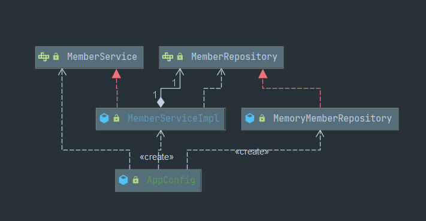

- 객체의 생성과 연결은 ```AppConfig```가 담당한다.
- **DIP 완성 :** ```MemberServiceImpl```은 ```MemberRepository```인 추상에만 의존하면 된다. 
이제 구체 클래스를 몰라도 된다.
- **관심사의 분리 :** 객체를 생성하고 연결하는 역할과 실행하는 역할이 명확히 분리되었다.

**그림-회원 객체 인스턴스 다이어그램**

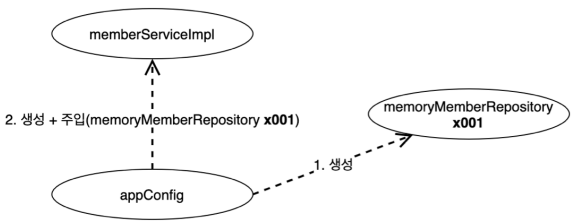

- ```appConfig```객체는```memoryMemberRepository```객체를 생성하고 그 참조값을 ```memberServiceImpl```을
생성하면서 생성자로 전달한다.
  
- 클라이언트인```memberServiceImpl```입장에서 보면 의존관계를 마치 외부에서 주입해주는 것 같다고 해서 
DI(Dependency Injection) 우리말로 의존관계 주입 또는 의존성 주입이라고 한다.
  
**OrderServiceImpl-생성자 주입**
```java
public class OrderServiceImpl implements OrderService{

    private final MemberRepository memberRepository;
    private final DiscountPolicy discountPolicy;

    public OrderServiceImpl(MemberRepository memberRepository, DiscountPolicy discountPolicy) {
        this.memberRepository = memberRepository;
        this.discountPolicy = discountPolicy;
    }

    @Override
    public Order createOrder(Long memberId, String itemName, int itemPrice) {
        Member member = memberRepository.findById(memberId);
        int discountPrice = discountPolicy.discount(member, itemPrice);
        return new Order(memberId, itemName, itemPrice, discountPrice);
    }
}
```
- 설계 변경으로 ```OrderServiceImpl```은```FixDiscountPolicy```를 의존하지 않는다!
- 단지```DiscountPolicy```인터페이스만 의존한다.
- ```OrderServiceImpl```입장에서 생성자를 통해 어떤 구현 객체가 들어올지(주입될지)알 수 없다.
- ```OrderServiceImple```의 생성자를 통해서 어떤 구현 객체를 주입할지는 오직 외부(```AppConfig```)에서 결정한다.
- ```OrderServiceImpl```은 이제부터 실행에만 집중하면 된다.
- ```OrderServiceImpl```에는```MemoryMemberRepository```,```FixDiscountPolicy```객체의 의존관계가 주입된다.

**테스트 코드 오류 수정**
```java
    @BeforeEach
    public void beforeEach(){
        AppConfig appConfig = new AppConfig();
        memberService = appConfig.memberService();
        orderService = appConfig.orderService();
    }
```

### AppConfig 리펙터링
현재 AppConfig를 보면 **중복**이 있고, **역할**에 따른 **구현**이 잘 안보인다.

**기대하는 그림**

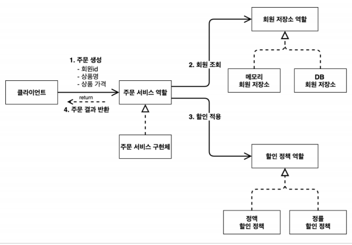

**리펙터링 후**
```java
public class AppConfig {

    public MemberService memberService(){
        return new MemberServiceImpl(memberRepository());
    }

    public MemoryMemberRepository memberRepository() {
        return new MemoryMemberRepository();
    }

    public OrderService orderService(){
        return new OrderServiceImpl(memberRepository(), discountPolicy());
    }

    public FixDiscountPolicy discountPolicy() {
        return new FixDiscountPolicy();
    }

}
```
- ```new MemoryMemberRepository()``` 이 부분이 중복 제거 되었다. 이제 ```MemoryMemberRepository```를
다른 구현체로 변경할 때 한 부분만 변경하면 된다.
  
- ```AppConfig```를 보면 역할과 구현 클래스가 한눈에 들어온다. 애플리케이션 전체 구성이 어떻게 진행되어 있는지
빠르게 파악할 수 있다.
### 좋은 객체 지향 설계의 5가지 원칙 적용
여기서 3가지 SRP, DIP OCP 적용

**단일 책임 원칙**
**한 클래스는 하나의 책임만 가져야 한다.**
- 클라이언트 객체는 직접 구현 객체를 생성하고, 연결하고, 실행하는 다양한 책임을 가지고 있음
- SRP 단일 책임 원칙을 따르면서 관심사를 분리함 
- 구현 객체를 생성하고 연결하는 책임은 AppConfig가 담당
- 클라이언트 객체는 실행하는 책임만 담당

**DIP 의존관계 역전 원칙**

**프로그래머는 "추상화에 의존해야지, 구체화에 의존하면 안된다." 의존성 주입은 이 원칙을 따르는 방법 중 하나다.**

- 새로운 할인 정책을 개발하고, 적용하려고 하니 클라이언트 코드도 함께 변경해야 했다. 왜냐하면 기존 클라이언트 
코드(```OrderServiceImpl```)는 DIP를 지키며 ```DiscountPolicy```추상화 인터페이스에 의존하는 것 같았지만,
```FixDiscountPolicy```구체화 구현 클래스에도 함께 의존했다.
  
- 클라이언트 코드가 ```DiscountPolicy```추상화 인터페이스에만 의존하도록 코드를 변경했다.
- 하지만 클라이언트 코드는 인터페이스로만으로는 아무것도 실행할 수 없다.
- AppConfig가 ```FixDiscountPolicy```객체 인스턴스를 클라이언트 코드 대신 생성해서 클라이언트 코드에 
의존관계를 주입했다. 이렇게해서 DIP 원칙을 따르면서 문제도 해결했다.

**OCP**
**소프트웨어 요소는 확장에는 열려 있으나 변경에는 닫혀 있어야 한다.**
- 다형성 사용하고 클라이언트가 DIP를 지킴
- 애플리케이션을 사용영역과 구성영역으로 나눔
- AppConfig가 의존관계를 ```FixDiscountPolicy``` → ```RateDiscountPolicy```로 변경해서 클라이언트 코드에
주입하므로 클라이언트 코드는 변경하지 않아도 됨
- **소프트웨어 요소를 새롭게 확장해도 사용 영역의 변경은 닫혀 있다.**

### Ioc,DI,그리고 컨테이너

**제어의 역전(Inversion of Control)**
- 기존 프로그램은 클라이언트 구현 객체가 스스로 필요한 서버 구현 객체를 생성하고, 연결하고, 실행했다. 한
마디로 구현 객체가 프로그램의 제어 흐름을 스스로 조종했다. 개발자 입장에서 자연스러운 흐름이다.
  
- 반면에 AppConfig가 등장한 이후에 구현 객체는 자신의 로직을 실행하는 역할만 담당한다. 프로그램의 제어 흐름
은 이제 AppConfig가 가져간다. 예를 들어서 ```OrderServiceImpl```은 필요한 인터페이스들을 호출하지만 어떤
구현 객체들이 실행될지 모른다.
  
- 프로그램에 대한 제어 흐름에 대한 권한은 모두 AppConfig가 가지고 있다. 심지어 ```OrderServiceImpl```도 
AppConfig가 생성한다. 그리고 AppConfig는 ```OrderServiceImpl```이 아닌 OrderService 인터페이스의 다른 구현 객체를
생성하고 실행할 수 도 있다. 그런 사실도 모른체 ```OrderServiceImpl```은 묵묵히 자신의 로직을 실행할 뿐이다.
  
- 이렇듯 프로그램 제어 흐름을 직접 제어하는 것이 아니라 외부에서 관리하는 것을 제어의 역전(IoC)이라 한다.

**프레임워크 vs 라이브러리**
- 프레임워크가 내가 작성한 코드를 제어하고, 대신 실행하면 그것은 프레임워크가 맞다.(JUnit)
- 반면에 내가 작성한 코드가 직접 제어의 흐름을 담당한다면 그것은 프레임워크가 아니라 라이브러리다.

**의존관계 주입 DI(Dependency Injection)**
- ```OrderServiceImpl```은 ```DiscountPolicy```인터페이스에 의존한다. 실제 어떤 구현 객체가 사용될지는 모른다.
- 의존관계는 **정적인 클래스 의존 관계와, 실행 시점에 결정되는 동적인 객체(인스턴스) 의존 관계** 둘을 분리해서 생각해야 한다.

**정적인 클래스 의존관계**
클래스가 사용하는 import 코드만 보고 의존관계를 쉽게 판단할 수 있다. 정적인 의존관계는 애플리케이션을 실행하지 
않아도 분석할 수 있다.

### 스프링으로 전환하기

지금까지는 순수한 자바 코드만으로 DI를 적용했다. 이제 스프링을 사용해보자.

**AppConfig** 스프링 기반으로 변경
```java
@Configuration
public class AppConfig {

    @Bean
    public MemberService memberService(){
        return new MemberServiceImpl(memberRepository());
    }

    @Bean
    public MemoryMemberRepository memberRepository() {
        return new MemoryMemberRepository();
    }

    @Bean
    public OrderService orderService(){
        return new OrderServiceImpl(memberRepository(), discountPolicy());
    }

    @Bean
    public FixDiscountPolicy discountPolicy() {
        return new FixDiscountPolicy();
    }

}
```

**스프링 컨테이너**
- ```ApplicationContext```를 스프링 컨테이너라 한다.
- 기존에는 개발자가 ```AppConfig```를 사용해서 직접 객체를 생성하고 DI를 했지만, 이제부터는 스프링 컨테이너를 통해서
사용한다.
  
- 스프링 컨테이너는```@Configuration```이 붙은 ```AppConfig```를 설정(구성)정보로 사용한다. 여기서```@Bean```
이라 적힌 메서드를 모두 호출해서 반환된 객체를 스프링 컨테이너에 등록한다.이렇게 스프링 컨테이너에 등록된 객체를 스프링 빈이라 한다.
  
- 스프링 빈은 ```@Bean```이 붙은 메서드의 명을 스프링 빈의 이름으로 사용한다. (```memberServie```,```orderService```)

- 이전에는 개발자가 필요한 객체를 ```AppConfig```를 사용해서 직접 조회했지만, 이제부터는 스프링 컨테이너를 통해서 필요한 스프링
빈(객체)를 찾아야 한다. 스프링 빈은 ```applicationContext.getBean()```메서드를 사용해서 찾을 수 있다.
  
- 기존에는 개발자가 직접 자바코드로 모든 것을 했다면 이제부터는 스프링 컨테이너에 객체를 스프링 빈으로 등록하고,
스프링 컨테이너에서 스프링 빈을 찾아서 사용하도록 변경되었다.
  
