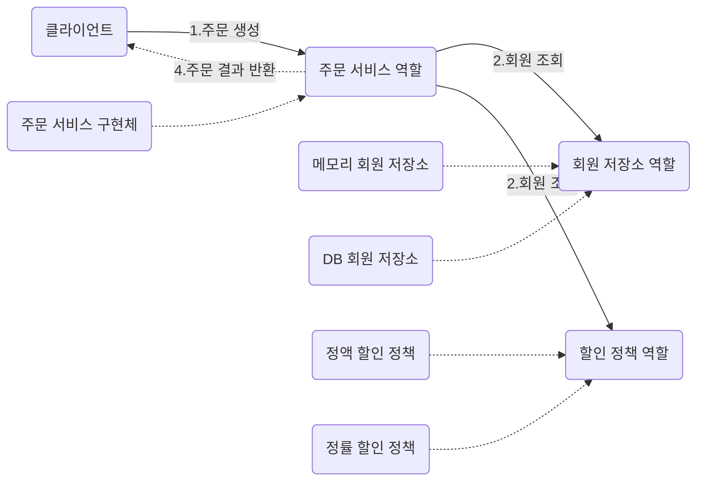

# spring-basic
스프링 기초


## 스프링 프레임워크

- **핵심 기술** : 스프링 DI 컨테이너, AOP, 이벤트, 기타
- **웹 기술** : 스프링 MVC, 스프링 WebFlux
- **데이터 접급기술** : 트랜잭션, JDBC, ORM 지원, XML 지원
- **기술 통합** : 캐시, 이메일, 원격접근, 스케줄링
- **테스트**: 스프링 기반 테스트 지원
- **언어** : 코틀린, 그루비
- 최근에는 스프링 부트를 통해서 스프링 프레임워크의 기술들을 편리하게 사용


## 스프링 부트 

- **스프링을 편리하게 사용할 수 있도록 지원, 최근에는 기본으로 사용**
- 단독으로 실행할 수 있는 스프링 애플리케이션을 쉽게 생성
- Tomcat같은 웹 서버를 내장해서 별도의 웹 서버를 설치하지 않아도 됨
- 손쉬운 빌드 구성을 위한 starter 종속성 제공
- 스프링과 3rd parth(외부) 라이브러리 자동 구성
- 메트릭, 상태확인, 외부 구성 같은 프로덕션 준비 기능 제공


## 스프링 핵심
- 스프링은 자바 언어 기반의 프레임워크 
- 자바 언어의 가장 큰 특징 - **객체 지향 언어**
- 스프링은 객체 지향 언어가 가진 강력한 특징을 살려내는 프레임워크
- 스프링은 **좋은 객체 지향** 애플리케이션을 개발할 수 있게 도와주는 프레임워크 

## 다형성 실세계
 


## 역할과 구현을 분리
- **역할**과 **구현**으로 구분하면 세상이 단순해지고, **유연**해지며 **변경**도 편리해진다.
- **장점**
    + 클라이언트는 대상의 역할(인터페이스)만 알면 된다.
    + 클라이언트는 구현 대상의 내부 구조를 몰라도 된다.
    + 클라이언트는 구현 대상의 내부 구조가 변경되어도 영향을 받지 않는다.
    + 클라이언트는 구현 대상 자체를 변경해도 영향을 받지 않는다. 
    


## 다형성의 본질
- **클라이언트 변경하지 않고,서버의 구현 기능을 유연하게 변경할 수 있다.**


## SOLID
클린코드로 유명한 로버트 마틴이 좋은 객체 지향 설계의 5가지 원칙을 정리

- SRP: 단일 책임 원칙 (single responsibility principle)
  + 한 클래스는 하나의 책임만 가져야 한다.
  + **즁요한 기준은 변경**이다. 변경이 있을 때 파급 효과가 적으면 단일 책임 원칙을 잘 따른 것 
- OCP : 개방-폐쇄 원칙(Open/closed principle)
    + 소프트웨어 요소는 **확장에는 열려** 있느나 변경에는 닫혀 있어야 한다
    + 다형성을 활용해보자.
    + 구현 객체를 변경하려면 클라이언트 코드를 변경해야 한다.
    + 분명 다형성을 사용했지만 OCP 원칙을 지킬 수 없다.
- LSP : 리스코프 치환 원칙 (Liskov substitution principle)
    + 프로그램의 객체는 프로그램의 정확성을 깨뜨리지 않으면서 하위 타입의 인스턴스로 바꿀 수 있어야 한다.
- ISP: 인터페이스 분리 원칙 (Interface segregation principle)
    + 특정 클라이언트를 위한 인터페이스 여러 개가 범용 인터페이스 하나보다 낫다.
- DIP : 의존관계 역전 원칙 (Dependency inversion principle)
    + 프로그래머는 "추상화에 의존해야지, 구체화에 의존하면 안된다" 의존성 주입은 이 원칙을 따르는 방법 중 하나이다.
    

## 비즈니스 요구사항과 설계
- 회원
    + 회원을 가입하고 조회할 수 있다.
    + 회원은 일반과 VIP 두 가지 등급이 있다.
    + 회원 데이터는 자체 DB를 구축할 수 있고, 외부 시스템과 연동할 수 있다. (미확정)
- 주문과 할인 정책
    + 회원은 상품을 주문할 수 있다.
    + 회원 등급에 따라 할인 정책을 적용할 수 있다.
    + 할인 정책은 모든 VIP는 1000원을 할인해주는 고정 금액 할인을 적용해달라. (나중에 변경 될 수 있 다.)
    + 할인 정책은 변경 가능성이 높다. 회사의 기본 할인 정책을 아직 정하지 못했고, 오픈 직전까지 고민을 
      미루고 싶다. 최악의 경우 할인을 적용하지 않을 수 도 있다. (미확정)


## 회원  도메인 설계
- 회원 도메인 요구사항
    + 회원을 가입하고 조회할 수 있다,.
    + 회원은 일반과 VIP 두 가지 등급이 있다.
    + 회원 데이터는 자체 DB를 구축할 수 있고, 외부 시스템과 연동할 수 있다.(미확정)
    


## 회원 도메인 개발

### 회원 엔티티

**회원 등급**

```java
public enum Grade {
    BASIC,
    VIP
}
```

**회원 엔티티**
```java
public class Member {
    private Long id;
    private String name;
    private Grade grade;

    public Member(Long id, String name, Grade grade) {
        this.id = id;
        this.name = name;
        this.grade = grade;
    }

    public Long getId() {
        return id;
    }

    public void setId(Long id) {
        this.id = id;
    }

    public String getName() {
        return name;
    }

    public void setName(String name) {
        this.name = name;
    }

    public Grade getGrade() {
        return grade;
    }

    public void setGrade(Grade grade) {
        this.grade = grade;
    }

    @Override
    public String toString() {
        return "Member{" +
                "id=" + id +
                ", name='" + name + '\'' +
                ", grade=" + grade +
                '}';
    }
}
```

### 회원 저장소

**회원 저장소 인터페이스**
```java
public interface MemberRepository {
    void save(Member member);
    Member findById(Long memberId);
}
```

**회원 저장소 구현체**
```java
public class MemoryMemberRepository implements MemberRepository{

    private static Map<Long, Member> store = new HashMap<>();

    @Override
    public void save(Member member) {
        store.put(member.getId(), member);
    }

    @Override
    public Member findById(Long memberId) {
        return store.get(memberId);
    }

}
```
### 회원 서비스 

**회원 서비스 인터페이스**
```java
public interface MemberService {
    void join(Member member);

    Member findMember(Long memberId);
}
```

**회원 서비스 구현체**
```java
public class MemberServiceImpl implements MemberService{

    private final MemberRepository memberRepository = new MemoryMemberRepository();

    @Override
    public void join(Member member) {
        memberRepository.save(member);
    }

    @Override
    public Member findMember(Long memberId) {
        return memberRepository.findById(memberId);
    }

}
```
### 회원 도메인 실행과 테스트
**회원 도메인 테스트**

```java
public class MemberServiceTest {

    private final MemberService memberService = new MemberServiceImpl();

    @Test
    void join(){
        // given
        Member member = new Member(1L, "memberA", Grade.VIP);

        //when
        memberService.join(member);
        Member findMember = memberService.findMember(1L);
        //then
        Assertions.assertThat(member).isEqualTo(findMember);

    }
}
```

### 회원 도메인 설계의 문제점
- 이 코드의 설계상 문제점은 무엇일까?
- 다른 저장소로 변경할 때 OCP 원칙을 잘 준수할까요? 
- DIP를 잘 지키고 있을까?
- **의존관계가 인터페이스 뿐만 아니라 구현까지 모두 의존하는 문제점이 있음**

## 주문과 할인 도메인 설계
- 주문과 할인 정책
  + 회원은 상품을 주문할 수 있다. 
  + 회원 등급에 따라 할인 정책을 적용할 수 있다. 
  + 할인 정책은 모든 VIP는 1000원을 할인해주는 고정 금액 할인을 적용해달라. (나중에 변경 될 수 있다.)
  + 할인 정책은 변경 가능성이 높다. 회사의 기본 할인 정책을 아직 정하지 못했고, 오픈 직전까지 고민을 미루고 싶다.
  최악의 경우 할인을 적용하지 않을 수 도 있다. (미확정)
    
### 주문 도메인 협력,역할,책임

**1. 주문생성** : 클라이언트는 주문 서비스에 주문 생성을 요청한다.
**2. 회원조회** : 할인을 위해서는 회원 등급이 필요하다. 그래서 주문 서비스는 회원 저장소에서 회원을 조회한다.
**3. 할인적용** : 주문 서비스는 회원 등급에 따른 할인 여부를 할인 정책에 위임한다.
**4. 주문 결과 반환** : 주문 서비스는 할인 결과를 포함한 주문 결과를 반환한다.

### 주문 도메인 전체

역할과 구현을 분리해서 자유롭게 구현 객체를 조립할 수 있게 설계 했다. 덕분에 회원 저장소는 물론이고, 할인 정책도 유연하게 변경할 수 있다.

### 주문 도메인 클래스 다이어그램 


회원을 메모리에서 조회하고, 정액 할인 정책(고정 금액)을 지원해도 주문 서비스를 변경하지 않아도 된다.

회원을 메모리가 아닌 실제 DB에서 조회하고, 정률 할인 정책(주문 금액에 따라 %할인)을 지원해도 주문서비스를
변경하지 않아도 된다. 협력 관계를 그대로 재사용 할 수 있다. 

### 주문과 할인 도메인 개발
**할인 정책 인터페이스**
```java
public interface DiscountPolicy {

    /**
     * @return 할인 대상 금액
     */
    int discount(Member member, int price);
}
```

**정액 할인 정책 구현체**
```java
public class FixDiscountPolicy implements DiscountPolicy{
    private int discountFixAmount = 1000;

    @Override
    public int discount(Member member, int price) {
        if(member.getGrade() == Grade.VIP)
            return discountFixAmount;
        else
            return 0;
    }
}
```

**주문 엔티티**
```java
public class Order {
    private Long memberId;
    private String itemName;
    private int itemPrice;
    private int discountPrice;

    public Order(Long memberId, String itemName, int itemPrice, int discountPrice) {
        this.memberId = memberId;
        this.itemName = itemName;
        this.itemPrice = itemPrice;
        this.discountPrice = discountPrice;
    }

    public Long getMemberId() {
        return memberId;
    }

    public void setMemberId(Long memberId) {
        this.memberId = memberId;
    }

    public String getItemName() {
        return itemName;
    }

    public void setItemName(String itemName) {
        this.itemName = itemName;
    }

    public int getItemPrice() {
        return itemPrice;
    }

    public void setItemPrice(int itemPrice) {
        this.itemPrice = itemPrice;
    }

    public int getDiscountPrice() {
        return discountPrice;
    }

    public void setDiscountPrice(int discountPrice) {
        this.discountPrice = discountPrice;
    }

    @Override
    public String toString() {
        return "Order{" +
                "memberId=" + memberId +
                ", itemName='" + itemName + '\'' +
                ", itemPrice=" + itemPrice +
                ", discountPrice=" + discountPrice +
                '}';
    }
}
```
**주문 서비스 인터페이스**
```java
public interface OrderService {

    Order createOrder(Long memberId, String itemName, int itemPrice);

}
```
**주문 서비스 구현체**
```java
public class OrderServiceImpl implements OrderService{

    private final MemberRepository memberRepository = new MemoryMemberRepository();
    private final DiscountPolicy discountPolicy = new FixDiscountPolicy();

    @Override
    public Order createOrder(Long memberId, String itemName, int itemPrice) {
        Member member = memberRepository.findById(memberId);
        int discountPrice = discountPolicy.discount(member, itemPrice);
        return new Order(memberId, itemName, itemPrice, discountPrice);
    }
}

```
주문 생성 요청이 오면, 회원 정보를 조회하고, 할인 정책을 적용한 다음 주문 객체를 생성해서 반환한다.
**메모리 회원 리포지토리와, 고정 금액 할인 정책을 구현체로 생성한다.**

### 주문과 할인 도메인 실행과 테스트
**주문과 할인 정책 실행**
```java
public class OrderServiceTest {
    MemberService memberService = new MemberServiceImpl();
    OrderService orderService = new OrderServiceImpl();

    @Test
    void createOrder(){
        long memberId = 1L;
        Member member = new Member(memberId, "memberA", Grade.VIP);
        memberService.join(member);

        Order order = orderService.createOrder(memberId, "itemA", 10000);
        Assertions.assertThat(order.getDiscountPrice()).isEqualTo(1000);
    }
}

```